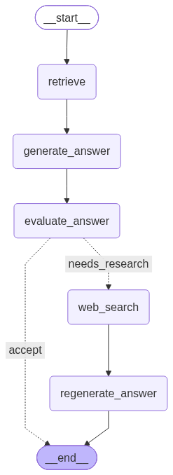

Agentic RAG — Self-Study Project

An experimental Agentic RAG workflow built with LangGraph, Chroma Cloud, Gemini, Tavily, and LangSmith.

  
  
  
  
  
  

Built as a hands-on experiment to understand how retrieval, generation, reflection, conditional routing, and web research fit together in an Agentic RAG system.

What I was experimenting with

The goal of this project was to move beyond a basic retrieve → generate RAG pipeline and experiment with a workflow that can evaluate its own answer and decide whether additional research is required.

The agent:

Retrieves relevant documents from Chroma Cloud

Generates an initial answer using Google Gemini

Uses an evaluator / reflection step to judge whether the answer is sufficiently supported

Routes the workflow based on that evaluation

Accepts the answer immediately when the retrieved knowledge is sufficient

Searches the web with Tavily when more information is needed

Regenerates the final answer using the retrieved context + web research

Agent workflow

  

The key branching decision is produced by the evaluator:

needs_research = False  →  Accept answer → END

needs_research = True   →  Web search → Regenerate answer → END

Architecture

Component

Responsibility

Chroma Cloud

Stores embedded knowledge-base chunks

Hugging Face Embeddings

Creates vector embeddings for ingestion and retrieval

Retriever Node

Fetches the most relevant context for the user question

Gemini Generator

Generates the first answer from retrieved evidence

Gemini Evaluator

Reflects on the answer using structured output

Conditional Routing

Chooses accept or needs_research

Tavily Search

Retrieves additional web information when needed

Regeneration Node

Produces a new answer from retrieved + web context

LangGraph

Orchestrates state and workflow transitions

LangSmith

Traces prompts, model calls, state transitions, and outputs

State used by the graph

question: str
documents: list[Document]
answer: str
evaluation_reason: str
needs_research: bool
research_query: str
web_context: str

The evaluator returns structured information such as:

{
    "evaluation_reason": "...",
    "needs_research": True,
    "research_query": "..."
}

LangGraph then uses needs_research to choose the next edge.

Project structure

src/selfstudyproject/
│
├── nodes/
│   ├── retrieve.py
│   ├── generate_answer.py
│   ├── evaluate_answer.py
│   ├── web_search.py
│   └── regenerate_answer.py
│
├── scripts/
│   ├── ingest.py
│   └── run_agent.py
│
├── chroma_store.py
├── config.py
├── embeddings.py
├── graph.py
├── ingestion.py
├── llm.py
├── routing.py
├── sources.py
└── state.py

Quick start

1. Install dependencies

This project uses uv.

uv sync

2. Add your API keys and Chroma Cloud configuration

Create a .env file in the project root:

CHROMA_API_KEY=your_chroma_api_key
CHROMA_TENANT=your_chroma_tenant
CHROMA_DATABASE=your_chroma_database
CHROMA_COLLECTION=your_collection_name

GOOGLE_API_KEY=your_google_api_key
TAVILY_API_KEY=your_tavily_api_key

3. Run the agent

If your Chroma collection is already populated:

uv run python -m selfstudyproject.scripts.run_agent

You will be prompted to enter a question:

Enter a question:

The graph then decides whether the answer can be returned from the retrieved knowledge or whether additional web research is required.

<strong>Need to ingest / refresh the knowledge base?</strong>

Run:

uv run python -m selfstudyproject.scripts.ingest

The ingestion workflow loads the configured sources, chunks the content, embeds it, and stores it in Chroma Cloud.

What I learned

This project helped me experiment with several concepts that are easy to understand individually but more interesting when combined:

Separating ingestion from runtime retrieval

Using a vector database for semantic retrieval

Passing shared state through LangGraph

Using separate LLM roles for generation and evaluation

Returning structured evaluation results with Pydantic

Using conditional edges instead of treating every decision as a node

Falling back to web research when the knowledge base is insufficient

Regenerating an answer from multiple evidence sources

Inspecting the entire workflow through LangSmith

Current status

Learning / experimental project — not intended as a production-ready RAG system.

Possible next experiments include retrieval grading, source citations, reranking, better evaluation criteria, graph persistence, automated tests, and more advanced LangGraph patterns.

Built while learning Agentic AI, RAG, LangChain, and LangGraph.

